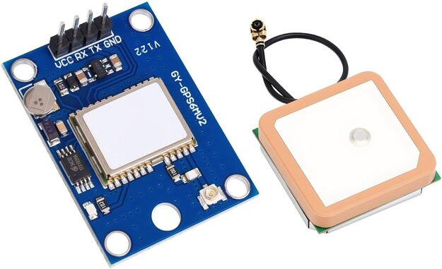

# HoverNet

HoverNet is a drone-based system designed to collect, analyze and Visualize Wi-Fi network data across physical environment using aerial sensing.

## Description

HoverNet combines a drone-mounted Wi-Fi scanning module with GPS tracking and an interactive web dashboard to provide a geographic understanding of wireless network distribution and security risks.

During flight, the system detects nearby access points and records technical data such as SSID, BSSID, signal strength (RSSI), channel, and encryption type. This data is linked with GPS coordinates and processed into an interactive map that allows users to explore wireless networks spatially.

The dashboard provides features such as:
- Access point mapping  
- Security risk classification  
- Drone flight path visualization  
- Access point coverage estimation  
- Detailed analysis pages for each network  

This system enables users to identify vulnerable networks and understand wireless coverage across large areas.

## Getting Started

### Dependencies

* Python 3.9+
* pandas
* numpy
* folium
* streamlit
* streamlit-folium
* math (standard library)

### Installing

Install required Python packages:

* pip install pandas numpy folium streamlit streamlit-folium

## Hardware Setup

This system uses onboard hardware mounted on a drone to collect Wi-Fi and location data in real time.

### ESP32-S3 CAM Board


The ESP32-S3 is responsible for scanning nearby Wi-Fi networks. It collects data such as SSID, BSSID, signal strength (RSSI), channel, and encryption type.

---

### NEO-6M GNSS Module


The GNSS module provides GPS coordinates for each detected access point. This allows the system to map wireless networks geographically.

---

### Executing program

* Run the dashboard:
```
streamlit run dashboard_app.py
```

* Open your browser:
```
http://localhost:8501
```

Use the interface:
View detected Wi-Fi networks on the map
Apply filters (RSSI, risk level)
Click on an access point to view detailed analysis

## Help

Common issues:

App not loading properly
- Restart Streamlit:
```
Ctrl + C
streamlit run dashboard_app.py
```

## References

- [Freenove ESP32-S3 CAM Board](https://www.amazon.ca/Freenove-ESP32-S3-Dual-core-Microcontroller-Wireless/dp/B0F48DV38M)
- [U-blox NEO6M GNSS Module](https://www.amazon.ca/dp/B0F2DP1189)
- [Leaflet.js](https://leafletjs.com/)
- [OpenStreetMap](https://www.openstreetmap.org)
- [GeoJSON](https://geojson.org/)

## Authors

. Amin Jafarpour
. Radman Mohammadi